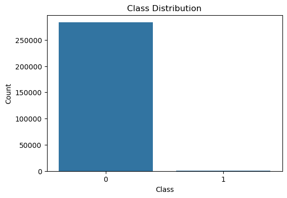
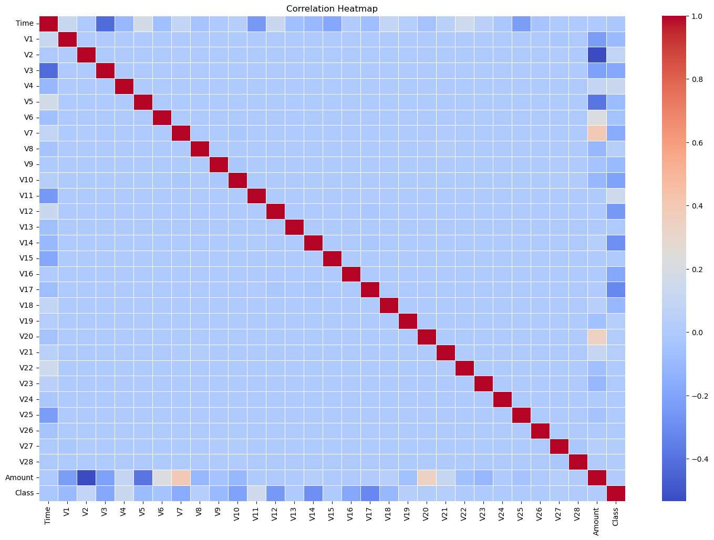
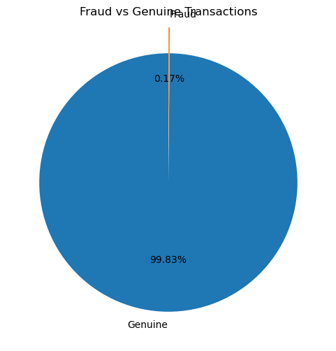
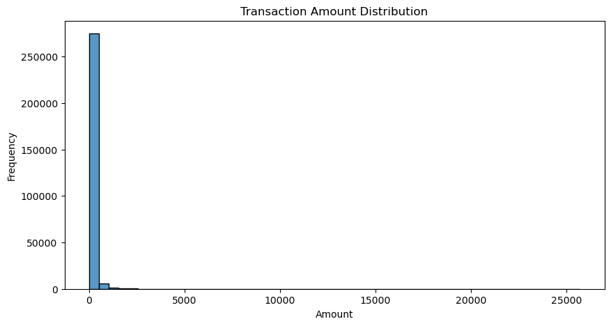
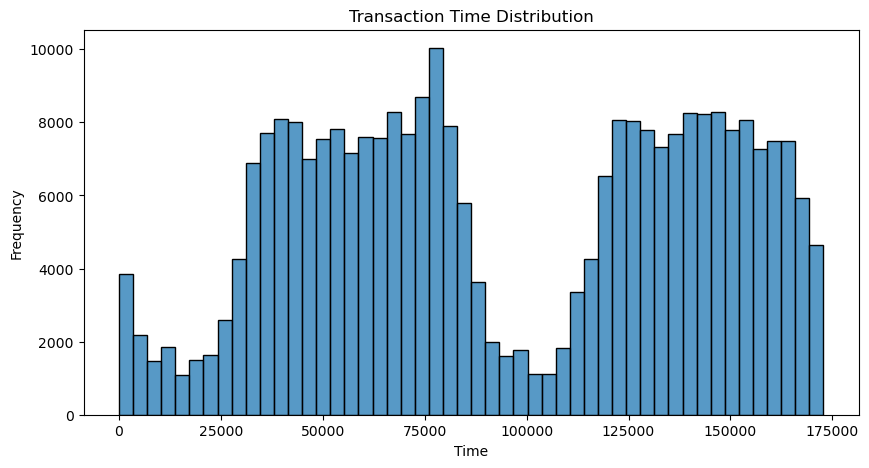
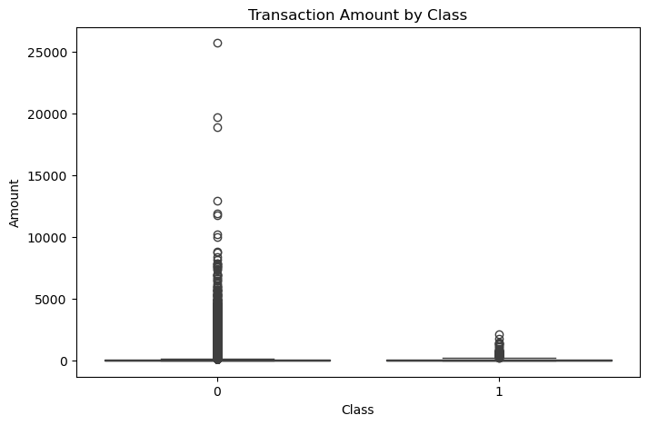
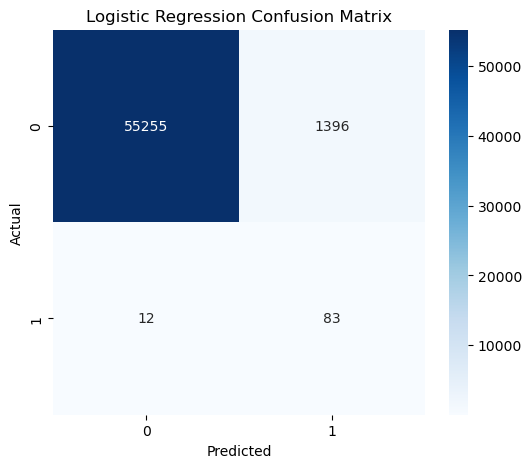
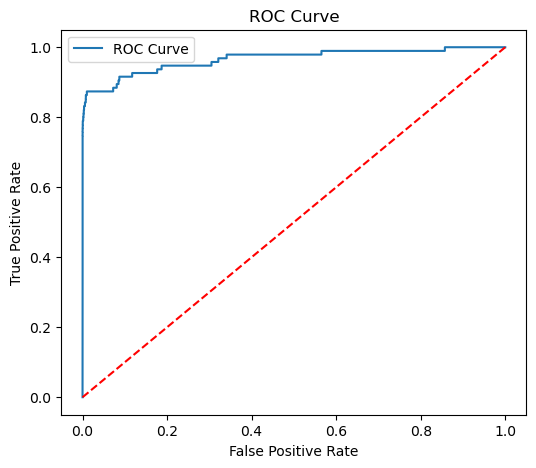
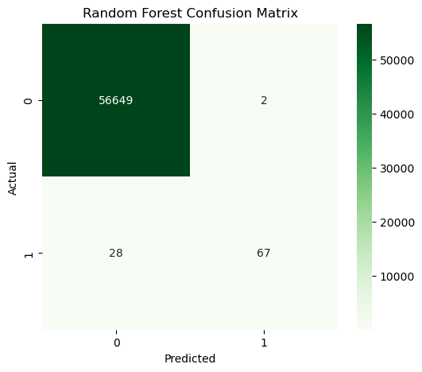
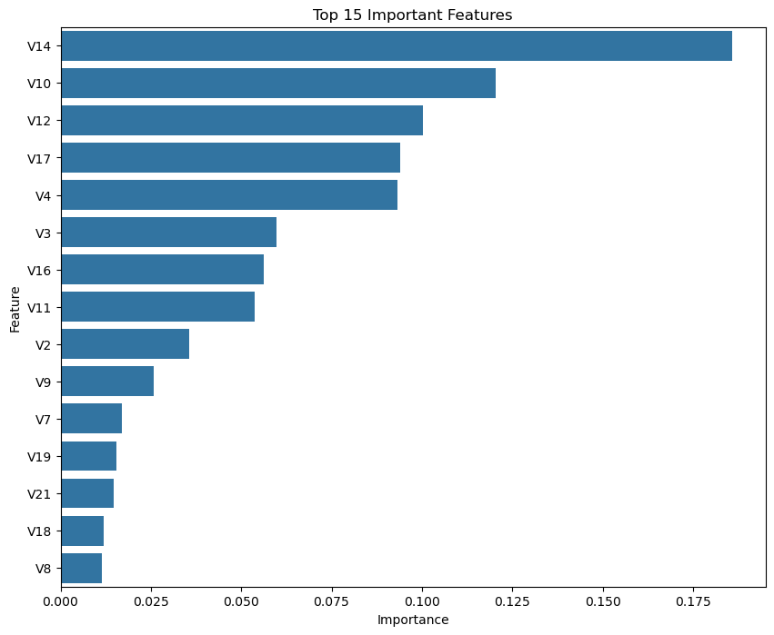

# 💳 Credit Card Fraud Detection using Machine Learning


## 📌 Project Overview

Credit card fraud is one of the biggest challenges in the banking industry. The objective of this project is to build a Machine Learning model that can accurately identify fraudulent credit card transactions while minimizing false predictions.

The project includes data preprocessing, exploratory data analysis (EDA), feature scaling, model training, performance evaluation, and model comparison using Logistic Regression and Random Forest Classifier.

---
## 🚀 Project Highlights

- Built an end-to-end Machine Learning pipeline for fraud detection.
- Performed comprehensive Exploratory Data Analysis (EDA).
- Compared Logistic Regression and Random Forest models.
- Achieved **99.95% Accuracy** using Random Forest.
- Achieved **97.14% Precision** in fraud detection.
- Saved the trained model using Joblib for future deployment.

---
## 🎯 Objectives

- Detect fraudulent credit card transactions.
- Perform data preprocessing and cleaning.
- Handle highly imbalanced data.
- Compare multiple Machine Learning models.
- Evaluate models using appropriate performance metrics.
- Save the best-performing model for future predictions.

---

## 📂 Dataset Information

- **Dataset:** Credit Card Fraud Detection Dataset
- **Source:** Kaggle - Credit Card Fraud Detection Dataset
- **Total Transactions:** 284,807
- **Features:** 31
- **Target Column:** Class

### Target Variable

- **0 → Genuine Transaction**
- **1 → Fraudulent Transaction**

---

## 🛠 Technologies Used

- Python
- NumPy
- Pandas
- Matplotlib
- Seaborn
- Scikit-learn
- Jupyter Notebook
- Joblib

---

## 📊 Exploratory Data Analysis (EDA)

The following analyses were performed:

- Dataset Overview
- Missing Value Analysis
- Duplicate Value Removal
- Class Distribution
- Correlation Heatmap
- Fraud vs Genuine Pie Chart
- Transaction Amount Distribution
- Transaction Time Distribution
- Transaction Amount by Class (Box Plot)

---

## ⚙️ Data Preprocessing

- Removed duplicate records
- Checked missing values
- Feature scaling using StandardScaler
- Train-Test Split (80:20)

---

## 🤖 Machine Learning Models

### 1️⃣ Logistic Regression

Used as the baseline classification model.

### 2️⃣ Random Forest Classifier

Used as the final model due to superior overall performance.

---

## 📈 Model Performance

| Model | Accuracy | Precision | Recall | F1 Score | ROC-AUC |
|--------|---------:|----------:|--------:|----------:|---------:|
| Logistic Regression | 97.52% | 5.61% | 87.37% | 10.55% | 96.58% |
| Random Forest | **99.95%** | **97.14%** | **71.58%** | **82.42%** | **94.47%** |

---

## 🏆 Best Model

Random Forest outperformed Logistic Regression by achieving significantly higher Precision, F1-Score, and overall Accuracy while maintaining strong fraud detection capability.

Therefore, Random Forest was selected as the final model.
---

## 📌 Key Findings

- No missing values were found.
- 1,081 duplicate records were removed.
- Dataset is highly imbalanced.
- Genuine transactions account for approximately 99.83%.
- Fraudulent transactions account for only 0.17%.
- Random Forest achieved the best overall performance.

---

## 📁 Project Structure

```
Credit-Card-Fraud-Detection/
│
├── Credit_Card_Fraud_Detection.ipynb
├── fraud_detection_model.pkl
├── README.md
├── requirements.txt
└── screenshots/
      ├── class_distribution.png
      ├── heatmap.png
      ├── pie_chart.png
      ├── amount_distribution.png
      ├── time_distribution.png
      ├── boxplot.png
      ├── logistic_confusion_matrix.png
      ├── roc_curve.png
      ├── random_forest_confusion_matrix.png
      ├── feature_importance.png
```

---

## 🚀 Installation

Clone the repository

```bash
git clone https://github.com/mohit-kanojiya/CODSOFT/edit/main//Credit-Card-Fraud-Detection.git
```

Go to project directory

```bash
cd Credit-Card-Fraud-Detection
```

Install dependencies

```bash
pip install -r requirements.txt
```

Run the notebook

```bash
jupyter notebook
```

---

## 📷 Project Screenshots

### Class Distribution



---

### Correlation Heatmap



---

### Fraud vs Genuine



---

### Amount Distribution



---

### Transaction Time Distribution



---

### Transaction Amount by Class



---

### Logistic Regression Confusion Matrix



---

### ROC Curve



---

### Random Forest Confusion Matrix



---

### Feature Importance
The figure below shows the Top 15 most important features identified by the Random Forest model during fraud detection.



---
# 📊 Results

✔ Successfully detected fraudulent credit card transactions.

✔ Achieved 99.95% Accuracy using Random Forest.

✔ Achieved 97.14% Precision.

✔ Achieved 82.42% F1 Score.

✔ Successfully saved the trained model using Joblib.

---

## 👨‍💻 Author

**Mohit Kanojiya**

