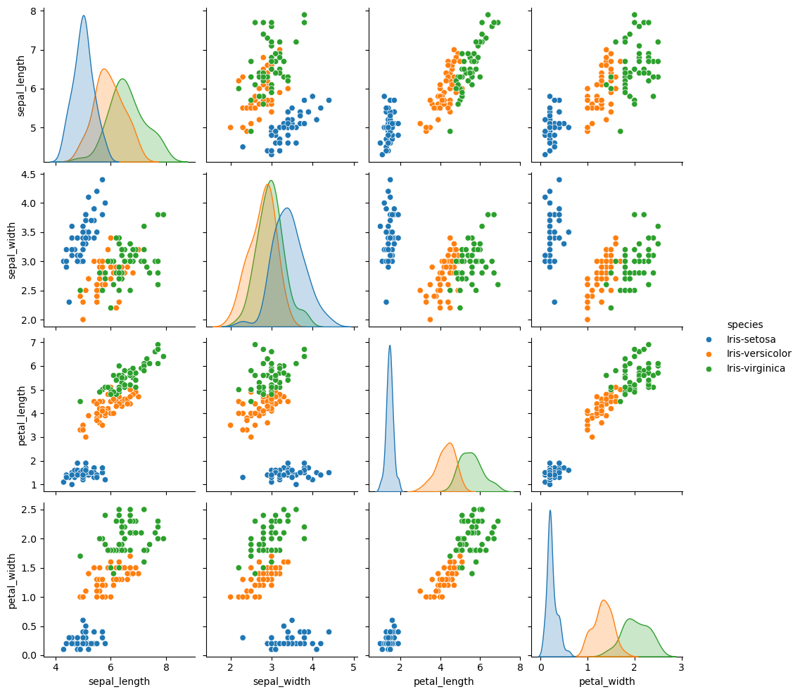
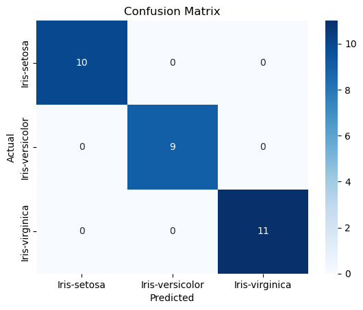
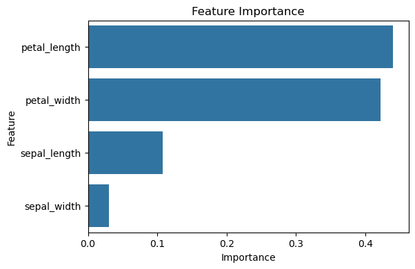

# 🌸 Iris Flower Classification using Machine Learning


## 📌 Project Overview

This project classifies Iris flowers into three different species using Machine Learning. A Random Forest Classifier is trained on the Iris dataset to predict the flower species based on four flower measurements.

The model can classify flowers into:

- Iris-setosa
- Iris-versicolor
- Iris-virginica

---

## 🎯 Objective

Build a Machine Learning classification model that predicts the species of an Iris flower using its physical measurements.

---

## 📂 Dataset

The Iris dataset contains **150 flower samples** with **4 numerical features** and **1 target column**.

### Features

- Sepal Length
- Sepal Width
- Petal Length
- Petal Width

### Target

- Species

> **Note:** The dataset is not included in this repository.

Dataset: [Iris Flower Dataset (Kaggle)](https://www.kaggle.com/datasets/arshid/iris-flower-dataset)

---

## 🛠 Technologies Used

- Python
- Pandas
- Matplotlib
- Seaborn
- Scikit-learn
- Joblib

---

## ✨ Key Features

- Predicts Iris flower species using Machine Learning
- Uses Random Forest Classifier
- Performs Exploratory Data Analysis (EDA)
- Generates Pairplot visualization
- Displays Confusion Matrix
- Shows Feature Importance
- Saves the trained model using Joblib

---

## 🤖 Machine Learning Algorithm

**Random Forest Classifier**

Random Forest is an ensemble learning algorithm that combines multiple decision trees to improve prediction accuracy and reduce overfitting.

---

## 📊 Project Workflow

1. Load Dataset
2. Explore Dataset
3. Check Missing Values
4. Data Visualization (Pairplot)
5. Split Dataset into Training & Testing
6. Train Random Forest Classifier
7. Make Predictions
8. Evaluate Model Performance
9. Display Confusion Matrix
10. Analyze Feature Importance
11. Save Trained Model

---

## 📈 Model Performance

| Metric | Score |
|---------|-------|
| Accuracy | **100%** |
| Algorithm | Random Forest Classifier |
| Train-Test Split | 80 : 20 |

---

## 🔍 Sample Prediction

### Input

| Sepal Length | Sepal Width | Petal Length | Petal Width |
|--------------|------------:|-------------:|------------:|
| 5.1 | 3.5 | 1.4 | 0.2 |

### Predicted Output
Iris-setosa

## 📷 Output

### Pairplot



---

### Confusion Matrix



---

### Feature Importance



---

## 📁 Project Structure

```
Iris-Flower-Classification/
│
├── iris_classification.py
├── iris_model.pkl
├── requirements.txt
├── README.md
└── screenshots/
    ├── pairplot.png
    ├── confusion_matrix.png
    └── feature_importance.png
```

---

## ▶️ How to Run

### Install Dependencies

```bash
pip install -r requirements.txt
```

### Run the Project

```bash
python iris_classification.py
```

---

## 👨‍💻 Author

**Mohit Kanojiya**
