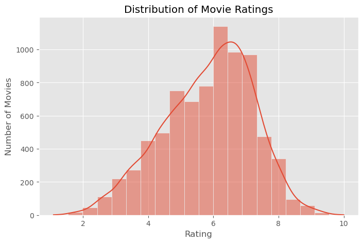
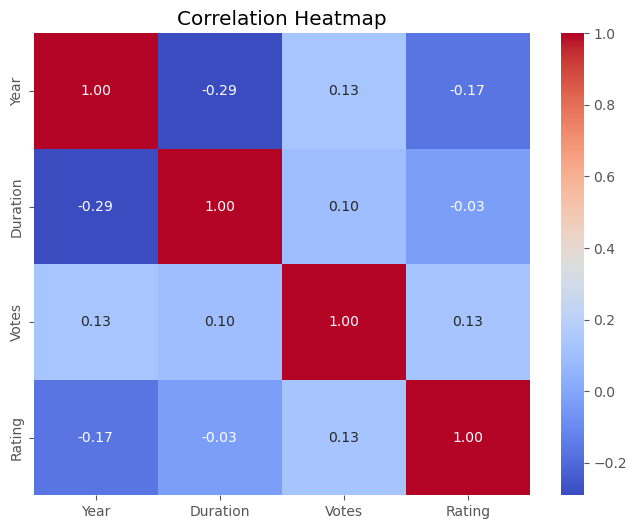
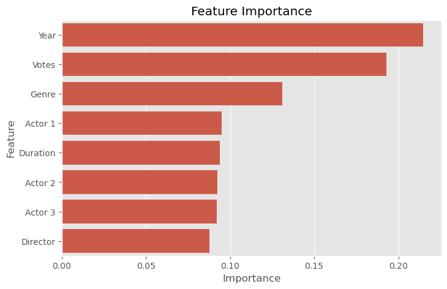

# 🎬 Movie Rating Prediction using Python

Predict IMDb movie ratings using Machine Learning based on movie features such as Genre, Director, Actors, Duration, Votes, and Release Year.

---

## 📌 Project Overview

This project is developed as part of the **CodSoft Data Science Internship**.

The objective of this project is to build a Machine Learning model that predicts the IMDb rating of a movie using historical movie data.

The project covers the complete Data Science workflow including:

- Data Collection
- Data Cleaning
- Exploratory Data Analysis (EDA)
- Feature Engineering
- Data Preprocessing
- Model Building
- Model Evaluation
- Model Saving

---

# 🎯 Problem Statement

Movie ratings are influenced by multiple factors such as:

- Genre
- Director
- Cast
- Duration
- Number of Votes
- Release Year

The goal is to train a Machine Learning model capable of predicting movie ratings using these features.

---

# 📂 Dataset

Dataset Name:

IMDb Movies India Dataset

🔗 **Download Dataset:**
https://www.kaggle.com/datasets/adrianmcmahon/imdb-india-movies

Features Used:

- Year
- Duration
- Votes
- Genre
- Director
- Actor 1
- Actor 2
- Actor 3

Target Variable:

- Rating

---

# 🛠 Technologies Used

- Python
- Pandas
- NumPy
- Matplotlib
- Seaborn
- Scikit-Learn
- Pickle
- Jupyter Notebook

---

# 📚 Machine Learning Workflow

### 1. Import Libraries

- Pandas
- NumPy
- Matplotlib
- Seaborn
- Scikit-Learn

---

### 2. Data Loading

- Read CSV Dataset
- Check Dataset Shape
- Display Dataset Information

---

### 3. Data Cleaning

Performed the following preprocessing steps:

- Removed missing target values
- Converted Year into numeric format
- Converted Duration into numeric values
- Converted Votes into numeric format
- Filled missing numeric values using Median
- Filled missing categorical values using Mode and "Unknown"

---

### 4. Exploratory Data Analysis (EDA)

Performed:

- Rating Distribution
- Top Genres
- Top Directors
- Rating vs Votes
- Correlation Heatmap

---

### 5. Feature Engineering

- Label Encoding
- Feature Selection
- Train-Test Split

---

### 6. Model Building

Model Used:

Random Forest Regressor

Hyperparameters:

```python
RandomForestRegressor(
    n_estimators=300,
    max_depth=20,
    min_samples_split=5,
    min_samples_leaf=2,
    max_features='sqrt',
    random_state=42,
    n_jobs=-1
)
```

# 📸 Project Screenshots

## Rating Distribution



---

## Correlation Heatmap



---

## Feature Importance



---


# 📁 Project Structure

```
Movie_Rating_Prediction/
│
├── Movie_Rating_Prediction.ipynb
│
├── Screenshots/
│   ├── rating_distribution.png
│   ├── correlation_heatmap.png
│   ├── feature_importance.png
│
├── requirements.txt
│
├── README.md
```

---

# ▶️ How to Run

### Clone Repository

```bash
git clone https://github.com/mohit-kanojiya/Movie_Rating_Prediction.git
```

---

### Install Dependencies

```bash
pip install -r requirements.txt
```

---

### Run Notebook

```bash
jupyter notebook
```

Open:

```
Movie_Rating_Prediction.ipynb
```

# 👨‍💻 Author

Mohit Kanojiya

GitHub:
https://github.com/mohit-kanojiya

---

# ⭐ If you found this project useful, don't forget to Star this repository.