# 📈 Sales Prediction Using Python

Predicting product sales based on advertising expenditure using Machine Learning and Linear Regression.


---

# 📌 Project Overview

Businesses invest heavily in advertising through different marketing channels such as **TV, Radio, and Newspaper**. Understanding how advertising budgets influence product sales helps companies optimize marketing strategies and improve Return on Investment (ROI).

This project builds a **Linear Regression Machine Learning model** to predict product sales using advertising expenditure across different media platforms.

---

# 🎯 Project Objective

- Predict product sales using advertising budgets.
- Analyze the relationship between advertising channels and sales.
- Visualize advertising trends using EDA.
- Build and evaluate a Linear Regression model.
- Help businesses make data-driven marketing decisions.

---

# 📂 Dataset

**Dataset Name:** Advertising Dataset

**Source:**
https://www.kaggle.com/code/ashydv/sales-prediction-simple-linear-regression/input

# 🛠 Technologies Used

- Python
- Pandas
- NumPy
- Matplotlib
- Seaborn
- Scikit-learn
- Jupyter Notebook
- Joblib

---

# 📊 Exploratory Data Analysis (EDA)

The dataset was analyzed using different visualization techniques.

## Correlation Heatmap

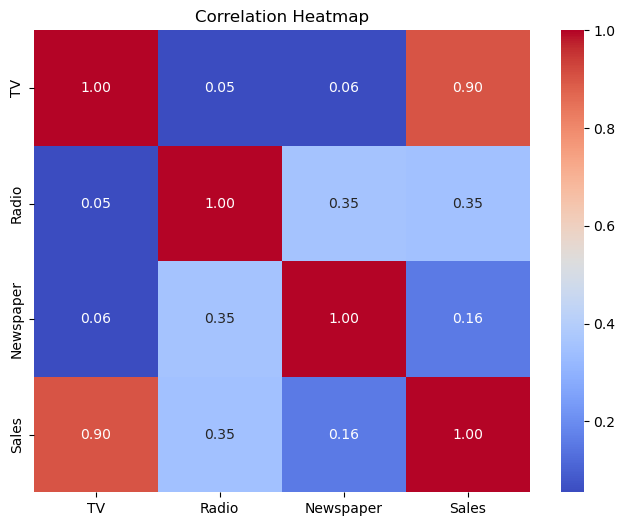

---

## Pairplot

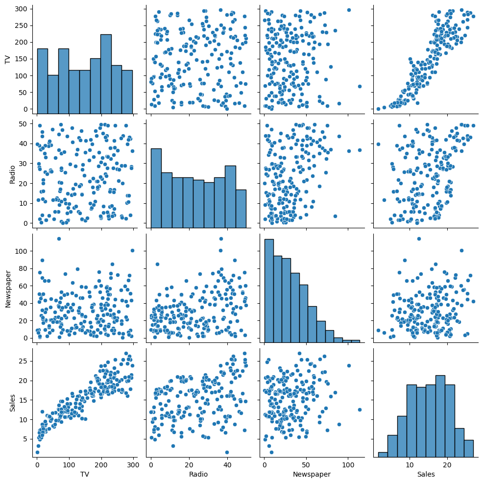

---

## Sales Distribution

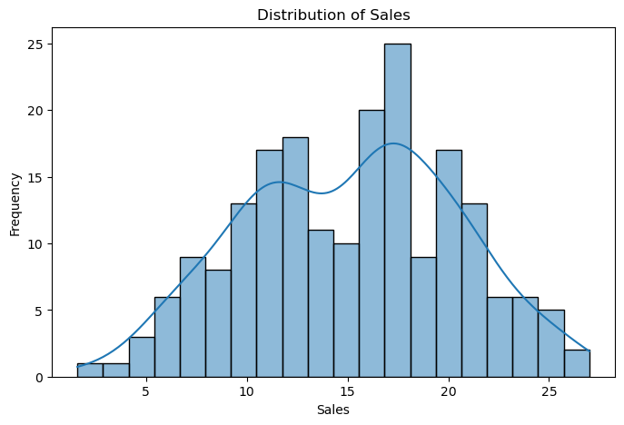

---

## Sales Boxplot

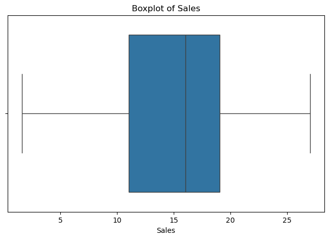

---

## TV vs Sales

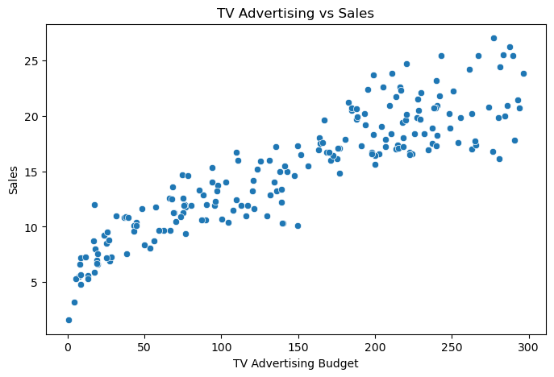

---

## Radio vs Sales

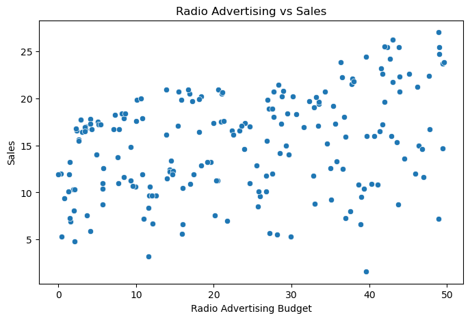

---

## Newspaper vs Sales

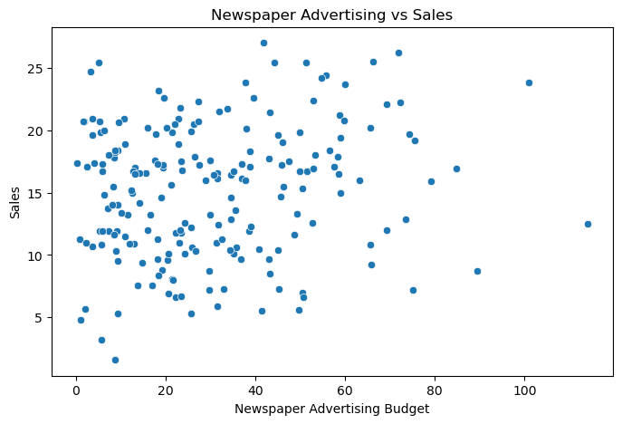

---

## Advertising Distribution

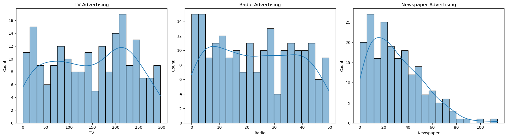

---

# ✨ Features

- Data Cleaning
- Exploratory Data Analysis (EDA)
- Correlation Analysis
- Data Visualization
- Linear Regression Model
- Sales Prediction
- Model Evaluation
- Model Serialization using Joblib

---

# 🤖 Machine Learning Model

**Algorithm Used:** Linear Regression

### Workflow

- Data Collection
- Data Cleaning
- Exploratory Data Analysis (EDA)
- Feature Selection
- Train-Test Split
- Model Training
- Sales Prediction
- Model Evaluation
- Model Saving using Joblib

---

# 📈 Model Performance

| Metric | Score |
|---------|--------|
| Mean Absolute Error (MAE) | **1.27** |
| Mean Squared Error (MSE) | **2.91** |
| Root Mean Squared Error (RMSE) | **1.71** |
| R² Score | **0.91** |

---

# 📌 Results

- Successfully predicted product sales using advertising expenditure.
- Achieved an R² Score of **0.91**.
- TV advertising showed the strongest relationship with sales.
- The trained model was saved using Joblib for future predictions.

---

## Actual vs Predicted Sales

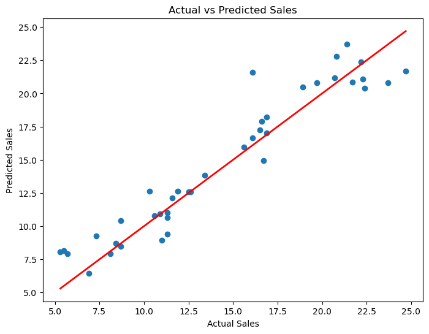

---

## Residual Plot

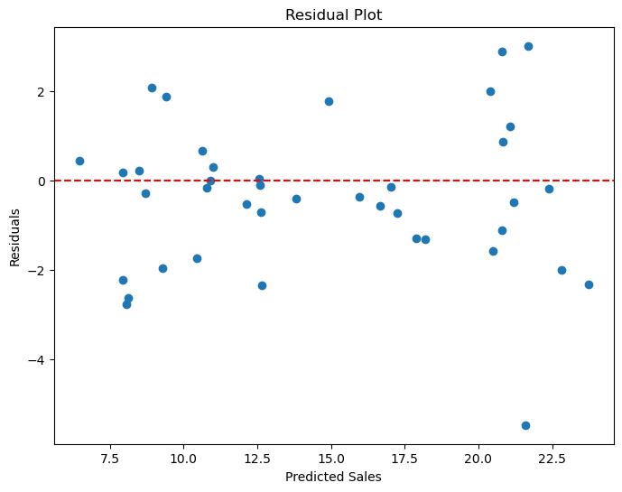

---

## Model Coefficients

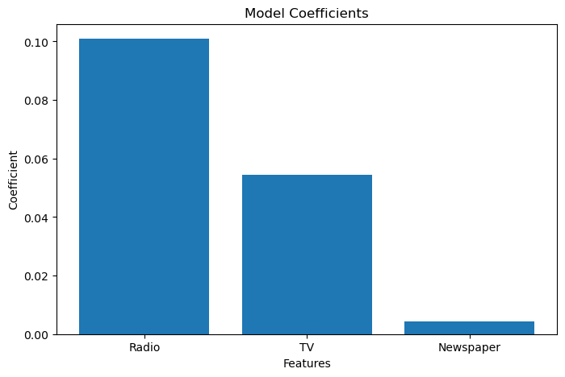

---

# 💼 Business Insights

- TV advertising shows the strongest positive correlation with product sales.
- Radio advertising also contributes positively but has a lower impact than TV.
- Newspaper advertising has the weakest influence on sales.
- The Linear Regression model achieved an R² Score of **0.91**, indicating excellent predictive performance.
- Businesses can use this model to estimate future sales and optimize advertising budgets across different marketing channels.

---

# 📁 Project Structure

```text
Sales-Prediction-Using-Python/
│
├── Sales_Prediction.ipynb
├── sales_prediction_model.joblib
├── requirements.txt
├── README.md
│
└── screenshots/
    ├── correlation_heatmap.png
    ├── pairplot.png
    ├── sales_distribution.png
    ├── sales_boxplot.png
    ├── tv_vs_sales.png
    ├── radio_vs_sales.png
    ├── newspaper_vs_sales.png
    ├── advertising_distribution.png
    ├── actual_vs_predicted.png
    ├── residual_plot.png
    └── model_coefficients.png
```

---

# ▶️ How to Run

```bash
git clone https://github.com/mohit-kanojiya/Sales-Prediction-Using-Python.git
```

```bash
cd Sales-Prediction-Using-Python
```

```bash
pip install -r requirements.txt
```

Run:

```
Sales_Prediction.ipynb
```

---

---

# 👨‍💻 Author

**Mohit Kanojiya**
