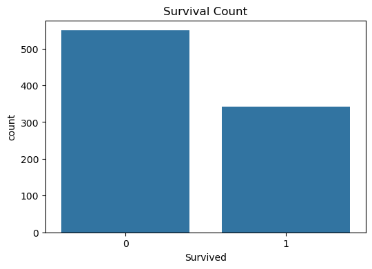
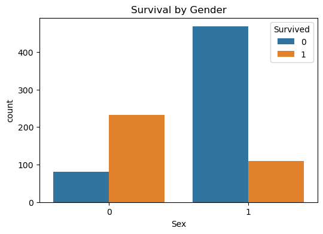
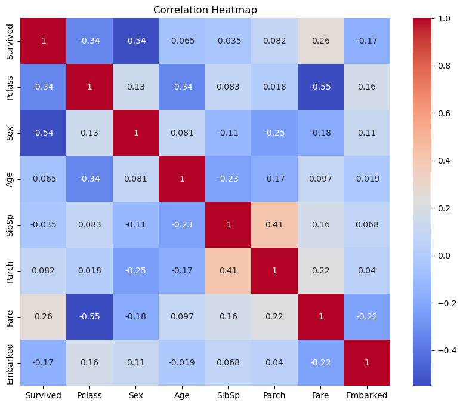
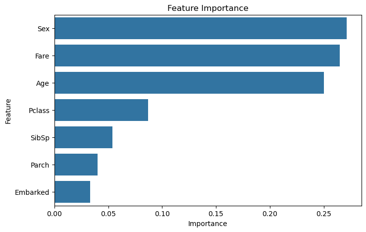

# 🚢 Titanic Survival Prediction using Machine Learning

## 📌 Project Overview

This project uses Machine Learning to predict whether a passenger survived the Titanic disaster based on features such as passenger class, gender, age, fare, family information, and embarkation port.

The project demonstrates the complete Machine Learning workflow, including data preprocessing, exploratory data analysis (EDA), model training, evaluation, and prediction.

This project was completed as part of the **CodSoft Data Science Internship**.

---

## 📁 Project Structure

```text
Titanic_Survival_Prediction/
│── Titanic_Survival_Prediction.ipynb
│── README.md
│── requirements.txt
│── screenshots/
│   ├── survival_count.png
│   ├── survival_by_gender.png
│   ├── correlation_heatmap.png
│   └── feature_importance.png
```


## 🎯 Objective

Build a classification model that predicts whether a passenger survived the Titanic disaster.

---

## 📂 Dataset

- **Dataset:** Titanic-Dataset.csv
- **Source:** Kaggle
- **Link:** https://www.kaggle.com/datasets/yasserh/titanic-dataset

## ⚙️ Installation

Clone the repository:

```bash
git clone https://github.com/mohit-kanojiya/CODSOFT.git


Install the required libraries:

```bash
pip install -r requirements.txt
```


Features used:
- Passenger Class (Pclass)
- Sex
- Age
- Number of Siblings/Spouses (SibSp)
- Number of Parents/Children (Parch)
- Fare
- Embarked

Target:
- Survived
  - 0 = Did Not Survive
  - 1 = Survived

---

## 🛠 Technologies Used

- Python
- Pandas
- NumPy
- Matplotlib
- Seaborn
- Scikit-learn
- Jupyter Notebook

---

## 📊 Machine Learning Models

- Logistic Regression
- Decision Tree Classifier
- Random Forest Classifier

---

## 🔍 Project Workflow

1. Import Libraries
2. Load Dataset
3. Data Exploration
4. Data Cleaning
5. Handle Missing Values
6. Encode Categorical Data
7. Exploratory Data Analysis (EDA)
8. Train-Test Split
9. Model Training
10. Model Evaluation
11. Passenger Survival Prediction

---

## 📈 Evaluation Metrics

- Accuracy Score
- Confusion Matrix
- Classification Report
- Feature Importance

---

## 🚀 Results

Three Machine Learning models were trained and evaluated:

- Logistic Regression
- Decision Tree Classifier
- Random Forest Classifier

Among these models, **Random Forest** achieved the highest accuracy and was selected as the final model for passenger survival prediction.

---
## 📷 Project Screenshots

### Survival Count



### Survival by Gender



### Correlation Heatmap



### Feature Importance




## 👨‍💻 Author

Mohit Kanojiya
GitHub: https://github.com/mohit-kanojiya
LinkedIn: www.linkedin.com/in/mohit-kanojiya-13mk